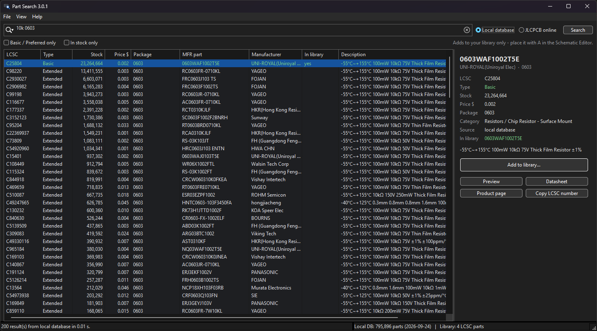
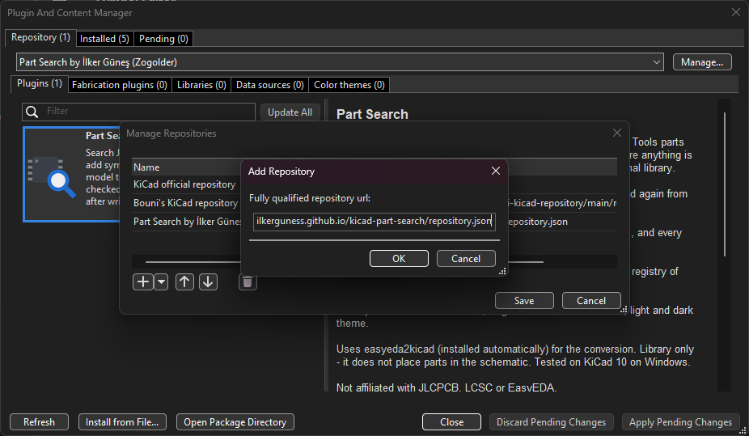
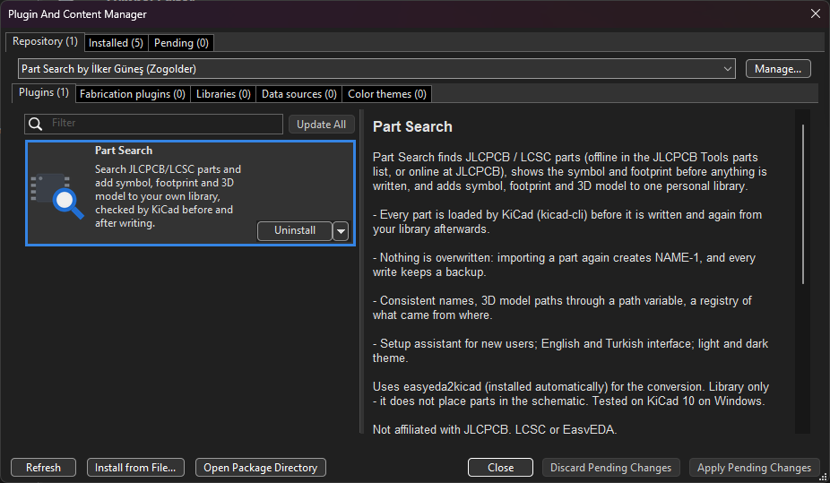
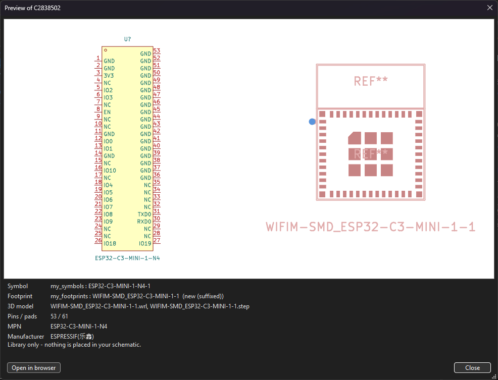

# Part Search for KiCad

Find a JLCPCB / LCSC part, look at its symbol and footprint, and add it — symbol, footprint and 3D model — to
your own KiCad library. Every part is loaded by KiCad itself before and after it is written, and nothing in your
library is ever overwritten.



- **Search** the offline JLCPCB parts list (fast, from the JLCPCB Tools plugin) or JLCPCB online (live stock).
- **See before you add**: symbol and footprint pictures, pin / pad count, 3D model, warnings.
- **Checked by KiCad**: `kicad-cli` loads the converted symbol and footprint before anything is written, and again
  from your library afterwards.
- **Safe for your library**: an existing part is never replaced — importing again creates `NAME-1`, and every write
  keeps a backup of the symbol library.
- **One library, consistent names**: symbol, footprint and 3D model share a name; 3D paths use a KiCad path
  variable, so the library can move.
- **Setup assistant** for new users, English and Turkish interface, light and dark theme.

It adds parts to your library only. Placing them is up to you (Schematic Editor, **A**).

**Install:** in KiCad's *Plugin and Content Manager* add the repository
`https://ilkerguness.github.io/kicad-part-search/repository.json` and install Part Search — step by step
under [Install](#install).

## Status

| | |
|---|---|
| Tested | KiCad 10.0 on Windows 11 and macOS (Intel MacBook Pro) |
| Needs | KiCad 10 with its bundled Python (3.9 or newer: KiCad 10 ships 3.11 on Windows, 3.9 on macOS) |
| Not tested yet | KiCad 9, Linux, Apple Silicon Macs (reports are welcome) |
| Version | see [CHANGELOG.md](CHANGELOG.md) |

## Install

Needs KiCad 10 (tested on Windows 11). Installing from the Part Search package repository is the easiest way, and
KiCad then offers new versions as updates.

### From the Part Search repository (recommended)

1. Open the **KiCad main window** (the project manager, not the Schematic Editor) and choose
   *Tools → Plugin and Content Manager* (Ctrl+M).
2. At the top, next to the repository list, click **Manage…**.
3. In *Manage Repositories* click the **+** button at the bottom left. In the small *Add Repository* window, paste
   this address into *Fully qualified repository url* and click **OK**:

   ```
   https://ilkerguness.github.io/kicad-part-search/repository.json
   ```

   
4. Click **Save**.
5. In the repository list at the top choose **Part Search by İlker Güneş (Zogolder)**. Part Search is listed under
   *Plugins*: click **Install**, then **Apply Pending Changes** at the bottom right.

   

   (The picture was taken on a PC where Part Search is already installed, so the button says *Uninstall*.)
6. Continue with [After installing](#after-installing).

To update later: open the Plugin and Content Manager, choose the Part Search repository and click **Update**
(or *Update All*).

### Other ways

- **From a file:** download `partsearch-<version>-pcm.zip` from the [Releases](../../releases) page and install it
  with *Plugin and Content Manager → Install from File…*.
- **By hand:** download `partsearch-<version>.zip` from the [Releases](../../releases) page and unzip it into
  KiCad's plugin folder, so that you get `…/plugins/partsearch/plugin.json`:
  - Windows: `Documents\KiCad\10.0\plugins\`
  - macOS / Linux: the `plugins` folder in KiCad's documents folder (not tested yet — see the
    [KiCad plugin documentation](https://dev-docs.kicad.org/en/apis-and-binding/ipc-api/for-addon-developers/))

### After installing

1. **Enable KiCad's plugin API**: KiCad → *Preferences* → *Plugins* → enable the API server. KiCad only shows
   buttons of plugins like this one when the API is on. Part Search does not read or change your open design —
   the button only starts the Part Search window.
2. Restart KiCad (or, in the Schematic Editor, *Tools → Refresh Plugins*). KiCad creates a Python environment for
   the plugin and installs its one dependency (easyeda2kicad, pinned version, checked against its published hash).
   This needs internet once.
3. Open the Schematic Editor and click the **Part Search** button in the top toolbar.

On the first start the **setup assistant** opens and shows three things:

| | What it does | Needed? |
|---|---|---|
| Downloading parts (easyeda2kicad) | installs it if KiCad has not | yes |
| Your library in KiCad | creates the library folder and registers it in KiCad (path variable + one symbol and one footprint library entry). Shows every change first, backs up each KiCad file, only adds. | yes (or do it by hand — the assistant shows the steps) |
| Offline search | explains how to get the parts database with the free [JLCPCB Tools](https://github.com/Bouni/kicad-jlcpcb-tools) plugin | optional — online search works without it |

Close KiCad before letting the assistant change KiCad's settings: KiCad keeps them in memory and may write its own
copy back when it closes. Part Search checks again on its next start.

## Use

1. Type a part number, value or LCSC number (`10k 0603`, `ESP32-C3`, `C25804`), choose *Local database* or
   *JLCPCB online*, press Enter.
2. Pick a part. Green type = JLCPCB Basic part (no extra assembly fee), grey = out of stock, highlighted = already
   in your library.
3. *Add to library…* — the part is downloaded, converted, checked, shown to you, and written only after you confirm.

   
4. In the Schematic Editor press **A** and search the symbol name.

*File → Check setup* shows what is missing; everything is logged (*File → Open log file*).

## How a part is added

```
fetch (easyeda2kicad) → rename + fix fields → validate with kicad-cli → plan (never overwrite) →
preview → write (+ backup) → verify: read back from disk and load again with kicad-cli
```

The symbol gets the `LCSC Part #`, MPN and manufacturer fields and a footprint link into your footprint library;
3D models are referenced as `${MYLIB_DIR}/my_3dmodels/…` (names configurable in *Settings*).

## Why another tool?

Good tools for LCSC / EasyEDA parts already exist, and Part Search builds on two of them:

| Tool | What it is for |
|---|---|
| [easyeda2kicad](https://github.com/uPesy/easyeda2kicad.py) | Command-line converter: give it an LCSC number, get a KiCad symbol, footprint and 3D model. Part Search uses it for the conversion. |
| [JLCPCB Tools](https://github.com/Bouni/kicad-jlcpcb-tools) | Preparing a JLCPCB assembly order: assign LCSC numbers, create BOM / CPL and Gerbers. It does not add parts to a library; its parts list is what Part Search searches offline. |
| [impart](https://github.com/Steffen-W/Import-LIB-KiCad-Plugin) | Importing library ZIPs downloaded from SnapMagic, UltraLibrarian, Samacsys and others, plus EasyEDA parts. |

Part Search covers the step between "I need a 10k 0603 that JLCPCB stocks" and "the part is in my library and I
trust it", in one window:

- **find** the part (offline list or live JLCPCB search, Basic parts first, stock and price visible),
- **look** at the symbol and footprint before anything is written,
- **check**: KiCad itself (`kicad-cli`) loads the converted part before writing and again from your library after,
- **keep your library safe**: nothing is overwritten, a repeated import becomes `NAME-1`, every write is backed up,
- **stay consistent**: one personal library, matching names, 3D paths through a path variable, a CSV registry of
  what came from where.

They work well side by side — for example JLCPCB Tools for the order, Part Search for the parts.

## Troubleshooting

| Problem | What to do |
|---|---|
| No Part Search button | Enable the plugin API ([After installing](#after-installing), step 1) and restart KiCad. |
| "easyeda2kicad is not installed" | *File → Setup assistant → Install*, or in KiCad *Preferences → Plugins* use "Recreate Plugin Environment". |
| "EasyEDA could not be reached" | No internet, or a firewall / proxy blocks easyeda.com. |
| "EasyEDA has no CAD data" | That part has no symbol / footprint on EasyEDA; pick another or draw it yourself. |
| Local search not available | The offline database is optional — see the setup assistant. |
| macOS: "CERTIFICATE_VERIFY_FAILED" | Part Search points Python at the certifi certificates when KiCad's Python finds none. If it still fails, check *File → Check setup* and the log. |
| macOS: kicad-cli not found | KiCad is looked for next to the running KiCad, in /Applications and ~/Applications. Otherwise set it in *Settings → Tools* (…/KiCad.app/Contents/MacOS/kicad-cli). |
| Anything else | *File → Check setup → Copy report* and open an issue with the report and the log. |

## Always check imported parts

Converted footprints can contain mistakes. Part Search checks that KiCad can load them, not that they match the
datasheet — compare pads and pin numbers before ordering boards.

## Licence and credits

Part Search © 2026 İlker Güneş (Zogolder), licensed under the
[GNU General Public License v3.0 or later](LICENSE).

It builds on [easyeda2kicad](https://github.com/uPesy/easyeda2kicad.py) (AGPL-3.0), KiCad, and optionally the
parts database of [JLCPCB Tools](https://github.com/Bouni/kicad-jlcpcb-tools) by Bouni. No third-party code or
data is included in this repository — see [THIRD_PARTY_NOTICES.md](THIRD_PARTY_NOTICES.md).

JLCPCB, LCSC and EasyEDA are trademarks of their owners. Part Search is not affiliated with or endorsed by them.
